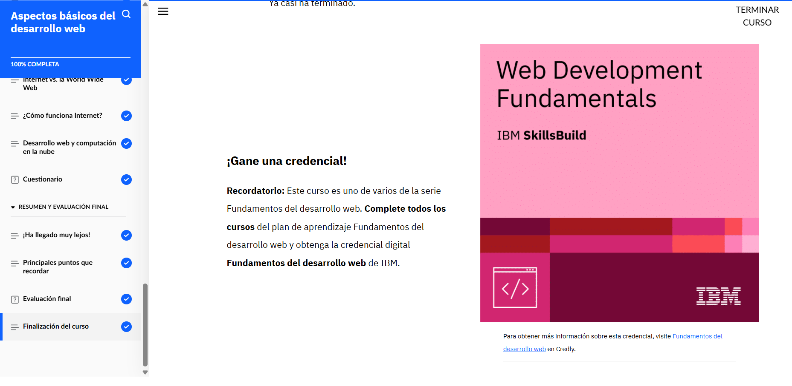

# Aspectos basicos del desarrolo web (2).

El desarrollo web es el proceso de construir, crear y mantener sitios web. Este proceso se divide en varias etapas, cada una de las cuales es fundamental para garantizar que un sitio web sea funcional, atractivo y accesible para los usuarios. A continuación, se explican algunos de los aspectos básicos clave del desarrollo web:

Lenguajes de Marcado y Estilo: El HTML (HyperText Markup Language) es el lenguaje básico utilizado para estructurar el contenido de un sitio web. HTML define los elementos esenciales de la página, como encabezados, párrafos, listas y enlaces. Por otro lado, CSS (Cascading Style Sheets) se utiliza para definir la apariencia del contenido, controlando aspectos como colores, fuentes, márgenes y disposición de los elementos en la página.

Interactividad con JavaScript: JavaScript es un lenguaje de programación utilizado para añadir interactividad a las páginas web. Con JavaScript, los desarrolladores pueden crear elementos interactivos como formularios, animaciones y actualizaciones dinámicas sin necesidad de recargar la página.

Diseño Responsivo: El diseño responsivo es una técnica fundamental en el desarrollo web moderno. Permite que un sitio web se adapte automáticamente a diferentes tamaños de pantalla, asegurando que el contenido sea accesible y legible en dispositivos como computadoras de escritorio, laptops, tabletas y teléfonos móviles.

Optimización y Accesibilidad: Los desarrolladores deben asegurarse de que los sitios web sean rápidos y accesibles para todos los usuarios, incluidos aquellos con discapacidades. Esto puede incluir la optimización del tiempo de carga mediante la compresión de imágenes y el uso de técnicas como el almacenamiento en caché, así como el cumplimiento de las pautas de accesibilidad web (WCAG).