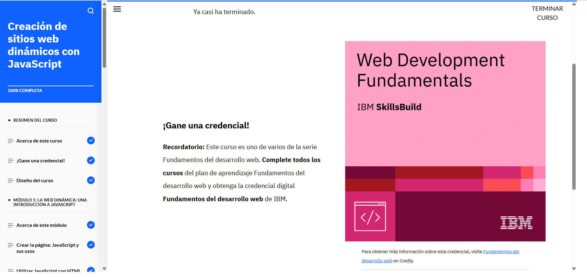

# Creación de sitios web dinámicos con JavaScript (4)



<p style="text-align: justify;">
Durante el desarrollo de sitios web dinámicos, JavaScript juega un papel fundamental al permitir la interacción y modificación en tiempo real de los elementos de la página. Esto se logra a través de eventos y manipulación del DOM (Modelo de Objetos del Documento).
</p>

## Manejadores de Eventos

<p style="text-align: justify;">
Un concepto clave en la creación de sitios web dinámicos es el uso de **manejadores de eventos**. Estos manejadores permiten ejecutar funciones específicas en respuesta a las acciones del usuario, como hacer clic en un botón o mover el ratón sobre un elemento. Un ejemplo básico de un manejador de eventos en JavaScript sería el siguiente:
</p>


```html
<button onclick="displayMessage()">Haz clic aquí</button>

<script>
  function displayMessage() {
    alert("¡Hola! Este es un mensaje dinámico.");
  }
</script>
```

<p style="text-align: justify;">
En este ejemplo, el código JavaScript se ejecuta cuando el usuario hace clic en el botón, mostrando un mensaje en pantalla.
</p>

## Modificación de Contenido con JavaScript

<p style="text-align: justify;">
JavaScript permite actualizar el contenido de una página web sin necesidad de recargarla, lo que se conoce como modificación dinámica del DOM. Esto es útil para crear sitios web interactivos donde los datos cambian en tiempo real.

Por ejemplo, si queremos cambiar el texto de un elemento div cuando se hace clic en un botón:
</p>

```html
<div id="message">Texto original</div>
<button onclick="changeText()">Cambiar Texto</button>

<script>
  function changeText() {
    document.getElementById("message").innerText = "¡Texto actualizado!";
  }
</script>
```
## Conclusión

<p style="text-align: justify;">JavaScript es esencial para crear sitios web dinámicos y mejorar la experiencia del usuario mediante la interactividad. Usar correctamente los manejadores de eventos y la manipulación del DOM es clave para el desarrollo de páginas web modernas que reaccionan ante las acciones de los usuarios en tiempo real.</p>


