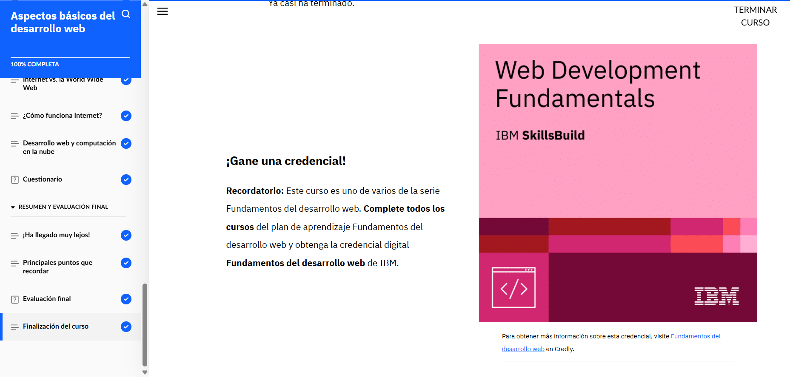

# Desarrollo de sitios para la web (2).

El desarrollo web se divide principalmente en dos áreas: front-end y back-end. El front-end es la parte visual e interactiva de un sitio web, es decir, lo que ve y con lo que interactúa el usuario. Los desarrolladores front-end utilizan HTML para crear la estructura de las páginas, CSS para darles estilo y JavaScript para añadir interactividad. Además, deben asegurarse de que los sitios sean accesibles para todos, se adapten a diferentes tamaños de pantalla (diseño responsivo) y estén optimizados para los motores de búsqueda (SEO). 

Por otro lado, el back-end se encarga de lo que sucede detrás de escena, como el manejo de bases de datos, la lógica del servidor y la seguridad. Los desarrolladores back-end trabajan con lenguajes como Java o Python, y crean APIs que permiten que el front-end se comunique con el servidor. También deben aplicar medidas de seguridad, como el cifrado de datos personales, y garantizar que los servicios sean escalables y funcionen correctamente.

En el proceso general de desarrollo web, se siguen pasos como la planificación, el diseño, la codificación, las pruebas y el mantenimiento. Cada etapa es clave para asegurar que el sitio web sea funcional, atractivo y accesible.

Además, se han tocado conceptos básicos de redes e infraestructura. Internet es la red física que conecta dispositivos, y la World Wide Web (WWW) es el sistema de contenido accesible a través de navegadores. Protocolos como TCP/IP permiten que los datos se transmitan correctamente, mientras que dispositivos como routers y módems gestionan esa conexión. Por último, los servicios en la nube ofrecen beneficios como el alojamiento de sitios web, almacenamiento de datos y distribución eficiente de cargas de trabajo, lo cual es vital para el rendimiento de aplicaciones modernas.
 

