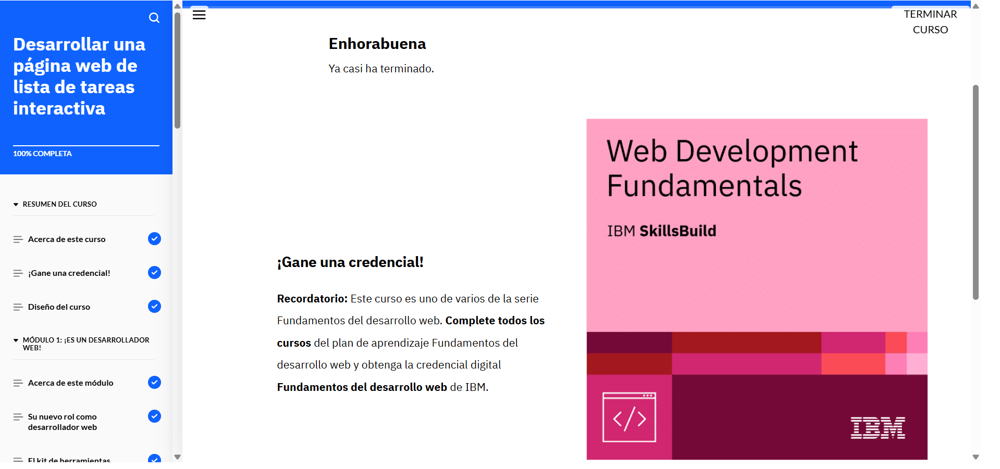

# Desarrollar una página web de lista de tareas interactivas (6) 

Para desarrollar una página web de lista de tareas interactivas, nos describian que se deben tener en cuenta varios aspectos clave que permitan a los usuarios añadir, marcar como completadas y eliminar tareas de manera efectiva. Aquí hay algunos puntos importantes que se deben considerar:

## 1. Estructura HTML
- **Contenedor Principal**: Se utiliza un `
` para contener los elementos principales de la página.
- **Elementos de Lista**: Se emplean listas (`<ul>` y `<li>`) para mostrar las tareas.
- **Entrada de Tareas**: Se usa un `<input>` para permitir que el usuario escriba la tarea que desea agregar.

## 2. Estilo CSS
- **Estilo Visual**: Se aplican estilos a través de un archivo CSS para mejorar la apariencia de los elementos, como márgenes, colores, fuentes, y el aspecto de los botones.
- **Barra de Desplazamiento**: Se configura la visibilidad de la barra de desplazamiento cuando el contenido excede una altura específica, por ejemplo, 300px.

## 3. Funcionalidad JavaScript
- **Añadir Tareas**: Se implementa un evento `onclick` para agregar nuevas tareas al presionar el botón "Añadir" o la tecla "Intro".
- **Marcar Tareas como Completadas**: Al hacer clic en una casilla de verificación, la tarea se tacha con un estilo CSS.
- **Eliminar Tareas**: Se añade un botón "Suprimir" junto a cada tarea para eliminarla de la lista.

## 4. Interacciones y Validación
- **Comportamiento de la Entrada**: Se asegura que los usuarios no puedan agregar tareas vacías. Si se intenta añadir una tarea sin texto, se muestra un mensaje de error.
- **Pruebas**: Es importante probar todas las funcionalidades: añadir tareas, marcarlas como completadas, eliminar tareas y comprobar la correcta visualización en diferentes dispositivos.

## 5. Usabilidad y Accesibilidad
- **Acceso desde Móviles y Escritorio**: La página debe ser responsiva y funcionar correctamente en dispositivos móviles y de escritorio.
- **Claridad de Mensajes**: Los mensajes para el usuario, como "Tarea agregada" o "No puede agregar una tarea vacía", deben ser claros y legibles.

## 6. Pruebas
- **Pruebas Funcionales**: Se debe probar que las tareas se agreguen, se marquen como completadas y se eliminen correctamente.
- **Pruebas Visuales**: Se debe verificar que los colores y los elementos visuales sean accesibles y legibles.

## Conclusión
Desarrollar una página web de lista de tareas interactivas requiere de una buena estructura HTML, un diseño atractivo en CSS, y funcionalidad dinámica en JavaScript. Además, es fundamental realizar pruebas para asegurar que todas las características funcionan correctamente y que la página es accesible en distintos dispositivos.
