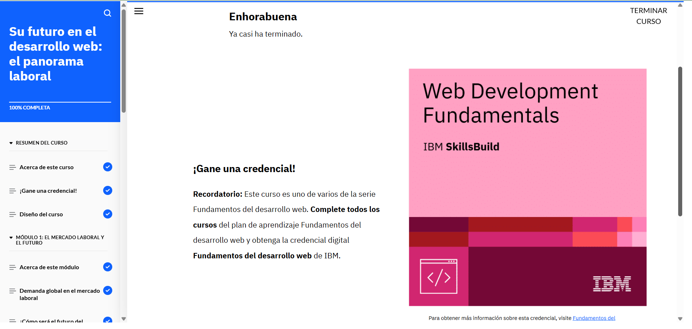

# Futuro laboral en desarrollo web (7)

En las últimas preguntas se discutieron roles y habilidades clave en el campo del desarrollo web, enfocándose en la diversidad de puestos y la importancia de las competencias técnicas y laborales. A continuación, se resumen los puntos clave:

- **Roles en desarrollo web**: Los roles de los desarrolladores pueden variar dependiendo de la especialización, como desarrollador front-end, back-end o full-stack. Cada uno tiene diferentes responsabilidades, desde crear la interfaz de usuario hasta gestionar servidores y bases de datos.

- **Especialización y habilidades**: Los empleadores a menudo buscan expertos en tecnologías específicas, como lenguajes de programación o frameworks. Sin embargo, también valoran habilidades blandas como comunicación, trabajo en equipo y pensamiento crítico.

- **Tendencias de empleo**: Los títulos de los puestos de trabajo pueden cambiar y centrarse en tecnologías o marcos específicos, lo que significa que es fundamental mantenerse actualizado en las herramientas y lenguajes más recientes.

Estos puntos subrayan la necesidad de especialización y adaptación constante en el ámbito del desarrollo web, mientras que las habilidades interpersonales también siguen siendo cruciales para el éxito laboral.
