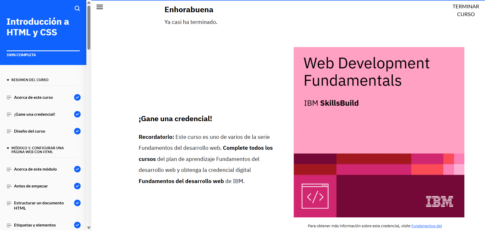

# Introducción a HTML y CSS (3)



### Buenas Prácticas en el Uso de CSS y HTML

<p style="text-align: justify;"> Uno de los puntos más relevantes es la organización y la reutilización del código. En lugar de usar estilos en línea en cada elemento HTML, lo ideal es crear hojas de estilo externas que puedan ser enlazadas desde múltiples páginas. Esto no solo mejora la consistencia del diseño, sino que también facilita el mantenimiento del código, ya que cualquier cambio en el estilo puede hacerse en un solo archivo.</p>

Por ejemplo, en vez de escribir un estilo en cada etiqueta de HTML como:

```html
<p style="color: blue; font-size: 16px;">Este es un párrafo con estilo en línea.</p>
```
Es mucho más eficiente crear una hoja de estilo externa llamada styles.css:
```css
p {
    color: blue;
    font-size: 16px;
}
```
Y luego enlazarla en el archivo HTML:

```html
<head>
    <link rel="stylesheet" href="styles.css">
</head>
```
<p style="text-align: justify;">Esto no solo hace que el código sea más limpio, sino que también permite modificar el estilo de múltiples páginas web con solo cambiar un archivo CSS. Esta es una práctica recomendada cuando trabajamos en proyectos grandes o colaborativos.</p>