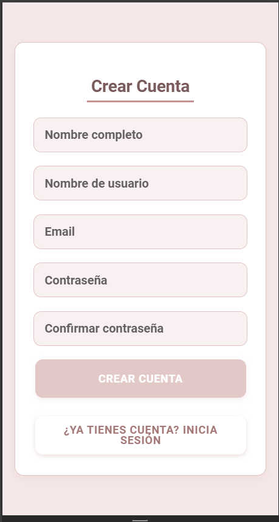
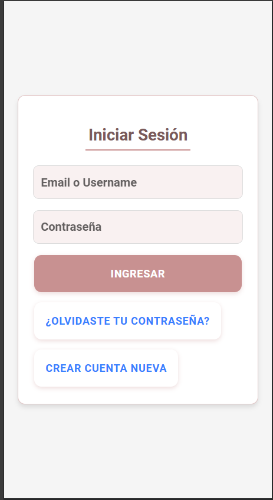
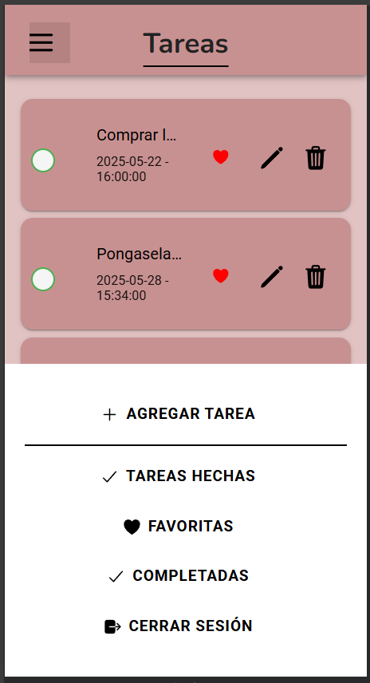
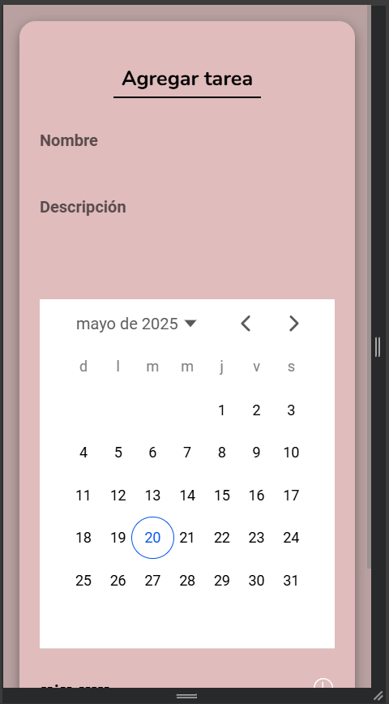
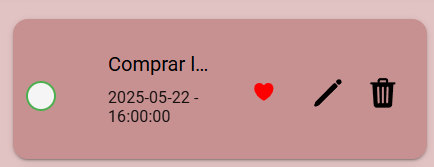
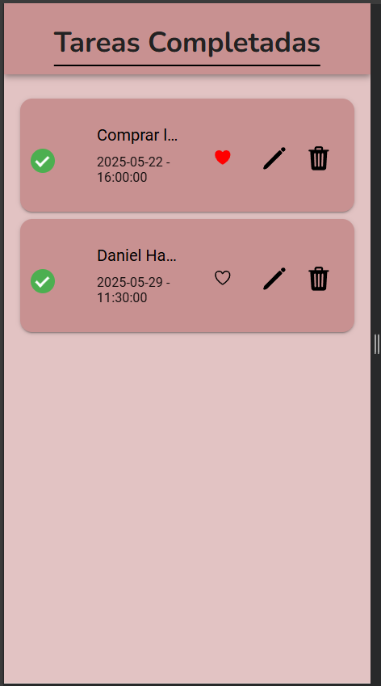
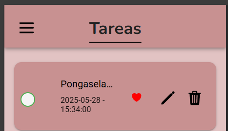
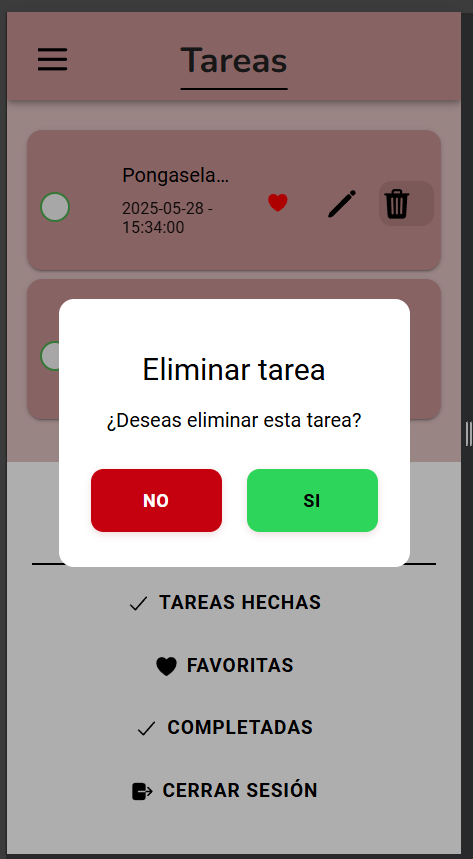
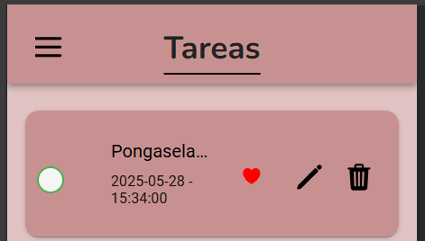
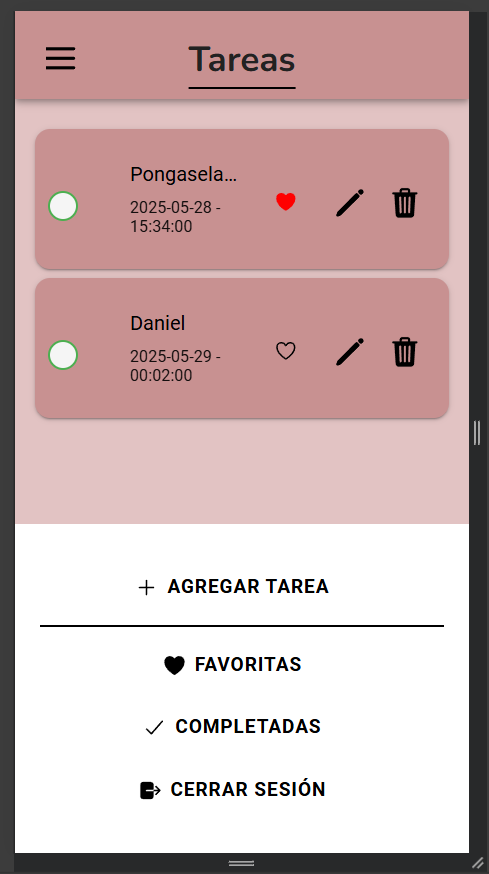

# BackLog

[Enlace Tablero Trello](https://trello.com/b/yvJWwqhG/todo-appprogramacionmovil)

## Tabla de Contenidos
1. [Introducción](#1-introducción)  
2. [Historias de Usuario](#2-historias-de-usuario)  
   - [HU-01: Entendimiento del Negocio](#hu-01-entendimiento-del-negocio)  
   - [HU-02: UI/UX](#hu-02-uiux)  
   - [HU-03: Registro e Inicio de Sesión](#hu-03-registro-e-inicio-de-sesión)  
   - [HU-04: Agregar Tareas](#hu-04-Agregar-una-Nueva-Tarea)  
   - [HU-05: Marcar Tareas Completadas](#hu-05-marcar-tareas-como-completadas)  
   - [HU-06: Eliminar Tareas](#hu-06-eliminar-una-tarea)  
   - [HU-07: Persistencia de Datos](#hu-07-Guardar-Tareas-en-el-dispositivo)  
   - [HU-08: Editar Tareas](#hu-08-Editar-una-Tarea)  
   - [HU-09: Visualización de Estado](#hu-09-Ver-el-Estado-de-Mis-Tareas)    

---

## 1. Introducción
Aplicación móvil para gestión de tareas personales con:  
✔ Autenticación de usuarios  
✔ Persistencia datos. 
✔ Operaciones CRUD completas  
✔ Sincronización entre dispositivos  

---

## 2. Historias de Usuario

# HU-01: Entendimiento de Negocio

## Descripción
Como equipo de desarrollo, necesitamos comprender la estructura del negocio, definir el modelo relacional de la base de datos y organizar el alcance del proyecto en tareas priorizadas, para garantizar una implementación eficiente y alineada con los objetivos del producto.

---

## Criterios de Aceptación
✅ Se debe desagregar la problemática en partes específicas.  
✅ Debe construirse un **Modelo Relacional (MR)** que refleje correctamente la estructura de la base de datos.  
✅ Se debe definir el **alcance del proyecto**, identificando funcionalidades prioritarias.  
✅ Incluir un **cronograma de trabajo** alineado con los sprints de desarrollo.  

---
## 1. Desglose del Problema
Para abordar correctamente el desarrollo de la aplicación, se identifican los siguientes aspectos clave:

- **Gestión de Usuarios:** Registro e inicio de sesión.  
- **Manejo de Tareas:** Creación, edición y eliminación de tareas.  
- **Notificaciones (Opcional):** Posibles alertas sobre tareas pendientes o vencidas.  

## 2. Construcción del Modelo Relacional (MR)
Se define un **modelo relacional** que incluye las siguientes entidades:

- **Usuarios**: Maneja la autenticación y roles de acceso.  
- **Tareas**: Almacena las tareas creadas, su estado y fechas clave.  
- **Notificaciones (Opcional)**: Permite alertar sobre tareas pendientes o vencidas.  
---------------------------------------
 

------------------------------------
**Nota:** Se debe garantizar que el modelo relacional esté **normalizado hasta la 3NF** para evitar redundancias.

---

## 3. Definición del Alcance y Priorización
### 🔹 **MVP (Minimum Viable Product)**
✅ Creación, edición y eliminación de tareas.  
✅ Autenticación de usuarios con roles básicos.  
✅ Sistema de notificaciones para recordatorios.  

### 🔹 **Funcionalidades Prioritarias Post-MVP**
🔹 Organización de tareas en categorías.  
🔹 Generación de reportes de productividad.  
🔹 Integración con asistentes de voz o calendarios externos.  

---

## 4. Cronograma de Trabajo (Sprints)
| Sprint | Duración |
|--------|----------|
| **Sprint 1** | 2025-02-03 al 2025-02-23 | 
| **Sprint 2** | 2025-02-24 al 2025-03-16 | 
| **Sprint 3** | 2025-03-17 al 2025-04-06 | 
| **Sprint 4** | 2025-04-07 al 2025-04-27 | 
| **Sprint 5** | 2025-04-28 al 2025-05-18 | 
---
 **Nota:** Las tareas se ajustarán en cada sprint según el avance y necesidades del equipo.  
---

**Este documento define el entendimiento del negocio, la estructura del modelo relacional y la planificación del desarrollo del sistema.**
---

# HU-02: UI/UX Base - Aplicación de Gestión de Tareas

## Descripción
Como usuario de la aplicación, quiero una interfaz clara e intuitiva que me permita gestionar mis tareas fácilmente, para mejorar la organización y recordar mis pendientes de manera eficiente.

---

## Criterios de Aceptación
✅ La aplicación debe permitir **agregar, editar y eliminar tareas**.  
✅ Debe existir una sección de **lista de tareas pendientes** y otra de **tareas realizadas**.  
✅ Se debe poder **marcar tareas como favoritas**.  
✅ Al eliminar una tarea, debe aparecer un **mensaje de confirmación**.  
✅ La aplicación debe incluir **una opción para iniciar sesión** con usuario/contraseña y con Google.  

---

## UI/UX Definido en el Mockup

### 🔹 Pantalla de Inicio (Login)
- Campos para usuario y contraseña.
- Botón de "Iniciar sesión".

### 🔹 Pantalla Principal
- Lista de **tareas pendientes** con opción de agregar nuevas.
- Lista de **tareas realizadas** para seguimiento.
- Opción de **marcar tareas como favoritas**.
- Botón para **agregar una nueva tarea**.

### 🔹 Pantalla de Agregar Tarea
- Campo para escribir la tarea.
- Opción de seleccionar **días para recordar**.
- Botones de **Crear** y **Cancelar**.
- Confirmación de "Tarea creada con éxito".

### 🔹 Pantalla de Edición de Tarea
- Campo para modificar la tarea existente.
- Opción de cambiar los días de recordatorio.
- Botones de **Confirmar** y **Cancelar**.

### 🔹 Pantalla de Eliminación de Tarea
- Mensaje de confirmación: "¿Estás seguro de eliminar X tarea?"
- Botón de **Sí** (Verde) y **No** (Rojo).

---

## Paleta de Colores
| Nombre en Texto         | Hexadecimal  |
|-------------------------|-------------|
| 🎨 **Fondo principal (Rosa Claro)**  | `#DFC4C4`  |
| 🔠 **Texto Negro**        | `#000000`  |
| 🔠 **Texto Blanco**       | `#FFFFFF`  |
| 🚨 **Botón Confirmar (Verde)** | `#008000`  |
| 🚨 **Botón Cancelar (Rojo)**   | `#FF0000`  |
| 🔘 **Botones generales (Negro)** | `#000000`  |
| 📜 **Barra desplegable (Blanco)** | `#FFFFFF`  |

---

## Tipografía
- **Fuente:** Nunito
- **Títulos:** 20px
- **Subtítulos:** 18px
- **Texto normal:** 18px 

---
**Este documento define la UI/UX base para el desarrollo de la aplicación de gestión de tareas.**
---

## HU-03: Registro e Inicio de Sesión

### Descripción
Como usuario, quiero poder registrarme e iniciar sesión en la aplicación, para que mis tareas estén seguras y pueda acceder a ellas desde cualquier dispositivo.

---

### Criterios de Aceptación
- ✅ El usuario puede registrarse con un correo y contraseña.  
- ✅ El usuario puede iniciar sesión con sus credenciales.  
- ✅ Se valida si el correo ya está registrado al intentar crear una cuenta.  
- ✅ Se muestra un mensaje de error si el usuario ingresa credenciales incorrectas.  
- ✅ Se mantiene la sesión iniciada hasta que el usuario cierre sesión manualmente.  

---

### Definición de Listo
- Se ha diseñado la pantalla de registro e inicio de sesión.  
- Se han definido las validaciones necesarias (como correo único y contraseña segura).  

---

### Definición de Hecho
- El usuario puede crear una cuenta e iniciar sesión sin errores.  
- Las credenciales se almacenan de forma segura.  
- Se han probado los flujos principales y manejo de errores.  

### Capturas de Funcionamiento
**Captura Registro**

**Captura Login**

---

## HU-04: Agregar una Nueva Tarea

### Descripción
Como usuario, quiero poder agregar una nueva tarea con un título y una descripción, para organizar mis pendientes y no olvidarlos.

---

### Criterios de Aceptación
- ✅ Se debe poder escribir una tarea en un campo de texto.  
- ✅ Debe existir un botón para agregar la tarea a la lista.  
- ✅ La tarea agregada debe mostrarse en la lista inmediatamente.  
- ✅ No se debe permitir agregar tareas vacías.  
- ✅ Opción para seleccionar fechas para hacer tareas.  
- ✅ Botón para cancelar la acción.  

---

### Definición de Listo
- El diseño de la interfaz está claro.  
- Se ha definido la estructura de la lista de tareas.  

---

### Definición de Hecho
- La funcionalidad está programada y funcionando correctamente.  
- Se ha probado en al menos un dispositivo físico o emulador.  
- No hay errores críticos que impidan el uso.  

### Capturas de Funcionamiento
**Captura Agregar**

**Captura Agregacion de Tarea**

---

## HU-05: Marcar Tareas como Completadas

### Descripción
Como usuario, quiero marcar una tarea como completada, para saber qué tareas ya he terminado y cuáles siguen pendientes.

---

### Criterios de Aceptación
- ✅ Cada tarea debe tener un checkbox o botón para marcarla como completada.  
- ✅ La tarea completada debe cambiar de estilo.  
- ✅ Las tareas completadas deben mantenerse en la lista hasta que sean eliminadas.  

---

### Definición de Listo
- Se ha definido cómo se mostrará una tarea completada.  

---

### Definición de Hecho
- La funcionalidad está implementada y probada.  
- No hay errores críticos.  

### Capturas de Funcionamiento
**Captura Vista Check**

**Captura Vista Completadas**

---

## HU-06: Eliminar una Tarea

### Descripción
Como usuario, quiero eliminar una tarea de la lista, para deshacerme de tareas innecesarias o creadas por error.

---

### Criterios de Aceptación
- ✅ Cada tarea debe tener un botón para eliminarla.  
- ✅ Al presionar el botón, la tarea debe desaparecer de la lista.  
- ✅ Se debe mostrar una alerta de confirmación antes de eliminar.  

---

### Definición de Listo
- Se ha definido cómo se eliminarán las tareas.  

---

### Definición de Hecho
- La funcionalidad está programada y probada.  

### Capturas de Funcionamiento
**Captura Vista Check Eliminar**

**Captura Vista Confirmacion**

---

## HU-07: Guardar Tareas en el Dispositivo

### Descripción
Como usuario, quiero que mis tareas se guarden en mi dispositivo, para que no se borren cuando cierre la aplicación.

---

### Criterios de Aceptación
- ✅ Al agregar una tarea, debe guardarse.
- ✅ Al cerrar y volver a abrir la app, las tareas deben seguir en la lista.  

---

### Definición de Listo
- Se ha decidido qué tecnología usar para el almacenamiento.  

---

### Definición de Hecho
- La funcionalidad está probada con tareas agregadas y eliminadas.  
---

## HU-08: Editar una Tarea

### Descripción
Como usuario, quiero poder modificar una tarea ya creada, para corregir errores o actualizar la información si es necesario.

---

### Criterios de Aceptación
- ✅ Debe haber un botón de edición en cada tarea.  
- ✅ Al editar, la tarea debe actualizarse en la lista.  

---

### Definición de Listo
- Se ha definido cómo funcionará la edición.  

---

### Definición de Hecho
- La funcionalidad está probada.  

### Capturas de Funcionamiento
**Captura Vista Check Editar**

**Captura Vista Formulario Edicion**

---

## HU-09: Ver el Estado de Mis Tareas

### Descripción
Como usuario, quiero ver mis tareas en una lista organizada, para identificar fácilmente cuáles están pendientes y cuáles ya completé.

---

### Criterios de Aceptación
- ✅ La pantalla principal debe mostrar todas las tareas.  
- ✅ Se debe diferenciar entre tareas completadas pendientes y resaltar favoritas.

---

### Definición de Listo
- Se ha definido el diseño visual de la lista.  

---

### Definición de Hecho
- La funcionalidad está probada en distintos dispositivos.  

### Capturas de Funcionamiento
**Captura Vista Opciones de Estados**

---
