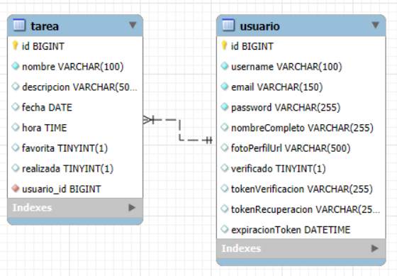

# 📘 Documentación General del Proyecto: TaskMaster App

## 📌 Planteamiento del Problema

La organización de tareas personales en dispositivos móviles suele ser limitada, dispersa y carente de funcionalidades que realmente apoyen la productividad del usuario. Muchas aplicaciones no ofrecen persistencia efectiva, vistas diferenciadas o sincronización de datos entre dispositivos.

**Problemática**:  
Los usuarios requieren una herramienta simple pero poderosa para gestionar sus pendientes diarios, con una interfaz intuitiva, persistencia de datos y opciones como favoritos y visualización del estado de las tareas.

---

## 🎯 Objetivos del Sistema

### Objetivo General

Desarrollar una aplicación móvil multiplataforma para la gestión de tareas personales que permita registrar, visualizar, organizar y mantener sincronizadas las tareas de un usuario de forma sencilla y eficiente.

### Objetivos Específicos

- Permitir el registro e inicio de sesión con correo o nombre de usuario.
- Implementar CRUD completo de tareas.
- Permitir marcar tareas como completadas y/o favoritas.
- Mostrar listas separadas según el estado de la tarea.
- Garantizar persistencia de datos localmente.
- Ofrecer interfaz amigable y responsive.

---

## ✅ Requerimientos Funcionales

- RF-01: Registro de usuario con nombre, correo, username y contraseña.
- RF-02: Inicio de sesión con correo o username y contraseña.
- RF-03: Crear, editar, eliminar y listar tareas.
- RF-04: Marcar tareas como completadas.
- RF-05: Marcar tareas como favoritas.
- RF-06: Ver tareas en listas organizadas (pendientes, completadas, favoritas).
- RF-07: Confirmación previa a eliminar tareas.
- RF-08: Guardar las tareas en el dispositivo.
- RF-09: Mantener la sesión iniciada hasta cierre manual.

---

## ❌ Requerimientos No Funcionales

- RNF-01: Persistencia de datos mediante almacenamiento local seguro.
- RNF-02: Validación de datos en formularios (campos obligatorios, formato de correo, etc).
- RNF-03: Interfaz intuitiva y responsive.
- RNF-04: Seguridad básica en almacenamiento de credenciales.
- RNF-05: Buen rendimiento en dispositivos con recursos limitados.

---

## ⚙️ Estructura Técnica del Sistema

- **Frontend móvil**: React/Ionic
- **Backend**: Spring Boot (Java 17)
- **Base de datos local**: MySQL

---

## 🧱 Arquitectura del Proyecto

**Arquitectura en Capas (Backend)**:

- **Presentación**: Interfaz de usuario
- **Lógica de negocio**: Controladores y servicios
- **Datos**: Repositorios locales/remotos

**Componentes principales (Frontend)**:
- Autenticación: registro e inicio de sesión
- Vista de tareas (CRUD)
- Filtros: favoritas, completadas
- Almacenamiento persistente

---

## 👤 Manual de Usuario

1. **Registro**: Elige “Registrarse”, ingresa nombre completo, correo, nombre de usuario y contraseña.
2. **Inicio de sesión**: Usa tu correo o nombre de usuario con tu contraseña.
3. **Agregar tarea**: Pulsa el botón “+”, completa el formulario y guarda.
4. **Editar tarea**: Pulsa el botón de lápiz en la tarea.
5. **Eliminar tarea**: Pulsa el botón de eliminar (basura), confirma la acción.
6. **Marcar tarea como completada**: Pulsa la casilla o icono correspondiente.
7. **Marcar como favorita**: Pulsa el icono de estrella.
8. **Navegar entre vistas**: Usa las pestañas para cambiar entre pendientes, completadas o favoritas.

---

## 🧩 Modelo Entidad-Relación (MER)



---

## 🗃 Modelo Relacional (MR)

### Tabla: Usuario

| Campo              | Tipo            | Restricciones                            |
|--------------------|-----------------|------------------------------------------|
| id                 | BIGINT          | PK, AUTO_INCREMENT                       |
| username           | VARCHAR         | UNIQUE, NOT NULL                         |
| email              | VARCHAR         | UNIQUE, NOT NULL                         |
| password           | VARCHAR         | NOT NULL (encriptada)                    |
| nombre_completo    | VARCHAR         | NULLABLE                                 |
| foto_perfil_url    | VARCHAR         | NULLABLE                                 |
| verificado         | BOOLEAN         | DEFAULT FALSE                            |
| token_verificacion | VARCHAR         | NULLABLE                                 |
| token_recuperacion | VARCHAR         | NULLABLE                                 |
| expiracion_token   | DATETIME        | NULLABLE                                 |

### Tabla: Tarea

| Campo          | Tipo        | Restricciones                                  |
|----------------|-------------|-----------------------------------------------|
| id             | BIGINT      | PK, AUTO_INCREMENT                            |
| nombre         | VARCHAR(50) | NULLABLE                                      |
| descripcion    | VARCHAR(255)| NULLABLE                                      |
| fecha          | DATE        | NULLABLE                                      |
| hora           | TIME        | NULLABLE                                      |
| favorita       | BOOLEAN     | DEFAULT FALSE                                 |
| realizada      | BOOLEAN     | DEFAULT FALSE                                 |
| usuario_id     | BIGINT      | FK → Usuario(id), NOT NULL, FetchType.EAGER   |

---

## 📊 Diagramas UML

---

### 📘 Diagrama de Clases

```bash
@startuml DiagramaClases

class Usuario {
  +Long id
  +String username
  +String email
  +String password
  +String nombreCompleto
  +String fotoPerfilUrl
  +boolean verificado
  +String tokenVerificacion
  +String tokenRecuperacion
  +LocalDateTime expiracionToken
}

class Tarea {
  +Long id
  +String nombre
  +String descripcion
  +LocalDate fecha
  +LocalTime hora
  +boolean favorita
  +boolean realizada
}

Usuario "1" --> "0..*" Tarea : crea >

@enduml

```

---

### 📗 Diagrama de Casos de Uso

```bash
@startuml DiagramaCasosUso

actor Usuario

rectangle "App de Tareas" {
  (Registrarse)
  (Iniciar sesión)
  (Crear tarea)
  (Editar tarea)
  (Eliminar tarea)
  (Marcar tarea como completada)
  (Marcar como favorita)
  (Ver listas de tareas)
}

Usuario --> (Registrarse)
Usuario --> (Iniciar sesión)
Usuario --> (Crear tarea)
Usuario --> (Editar tarea)
Usuario --> (Eliminar tarea)
Usuario --> (Marcar tarea como completada)
Usuario --> (Marcar como favorita)
Usuario --> (Ver listas de tareas)

@enduml
```
---

### 📙 Diagrama de Secuencia (Crear tarea)

```bash
@startuml DiagramaSecuenciaCrearTarea

actor Usuario
participant "App" as App
participant "Controlador" as Controlador
participant "Servicio" as Servicio
participant "Repositorio" as Repositorio

Usuario -> App : Ingresar datos de la tarea
App -> Controlador : Enviar solicitud POST /tareas
Controlador -> Servicio : Validar y procesar tarea
Servicio -> Repositorio : Guardar en base de datos
Repositorio --> Servicio : Confirmación
Servicio --> Controlador : Tarea creada correctamente
Controlador --> App : Respuesta con éxito
App --> Usuario : Mostrar confirmación

@enduml
```
