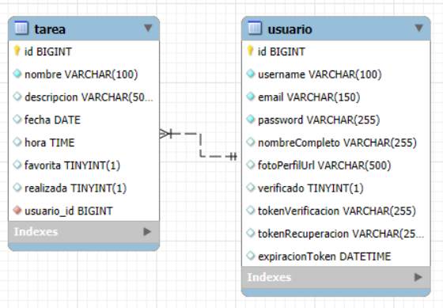

# HU-01: Entendimiento de Negocio

## Descripción

Como equipo de desarrollo, necesitamos comprender la estructura del negocio, definir el modelo relacional de la base de datos y organizar el alcance del proyecto en tareas priorizadas, para garantizar una implementación eficiente y alineada con los objetivos del producto.

---

## Criterios de Aceptación

✅ Se debe desagregar la problemática en partes específicas.  
✅ Debe construirse un **Modelo Relacional (MR)** que refleje correctamente la estructura de la base de datos.  
✅ Se debe definir el **alcance del proyecto**, identificando funcionalidades prioritarias.  
✅ Incluir un **cronograma de trabajo** alineado con los sprints de desarrollo.

---

## 1. Desglose del Problema

Para abordar correctamente el desarrollo de la aplicación, se identifican los siguientes aspectos clave:

- **Gestión de Usuarios:** Registro e inicio de sesión.
- **Manejo de Tareas:** Creación, edición y eliminación de tareas.
- **Notificaciones (Opcional):** Posibles alertas sobre tareas pendientes o vencidas.

## 2. Construcción del Modelo Relacional (MR)

Se define un **modelo relacional** que incluye las siguientes entidades:

- **Usuarios**: Maneja la autenticación y roles de acceso.
- **Tareas**: Almacena las tareas creadas, su estado y fechas clave.
- **Notificaciones (Opcional)**: Permite alertar sobre tareas pendientes o vencidas.

---

---

**Nota:** Se debe garantizar que el modelo relacional esté **normalizado hasta la 3NF** para evitar redundancias.

---

## 3. Definición del Alcance y Priorización

### 🔹 **MVP (Minimum Viable Product)**

✅ Creación, edición y eliminación de tareas.  
✅ Autenticación de usuarios con roles básicos.  
✅ Sistema de notificaciones para recordatorios.

### 🔹 **Funcionalidades Prioritarias Post-MVP**

🔹 Organización de tareas en categorías.  
🔹 Generación de reportes de productividad.  
🔹 Integración con asistentes de voz o calendarios externos.

---

## 4. Cronograma de Trabajo (Sprints)

| Sprint       | Duración                 |
| ------------ | ------------------------ |
| **Sprint 1** | 2025-02-03 al 2025-02-23 |
| **Sprint 2** | 2025-02-24 al 2025-03-16 |
| **Sprint 3** | 2025-03-17 al 2025-04-06 |
| **Sprint 4** | 2025-04-07 al 2025-04-27 |
| **Sprint 5** | 2025-04-28 al 2025-05-18 |

## **Nota:** Las tareas se ajustarán en cada sprint según el avance y necesidades del equipo.

**Este documento define el entendimiento del negocio, la estructura del modelo relacional y la planificación del desarrollo del sistema.**
