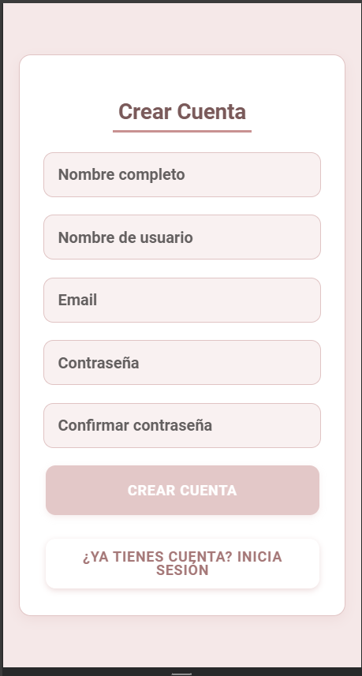

## HU-03: Registro e Inicio de Sesión

### Descripción
Como usuario, quiero poder registrarme e iniciar sesión en la aplicación, para que mis tareas estén seguras y pueda acceder a ellas desde cualquier dispositivo.

---

### Criterios de Aceptación
- ✅ El usuario puede registrarse con un correo y contraseña.  
- ✅ El usuario puede iniciar sesión con sus credenciales.  
- ✅ Se valida si el correo ya está registrado al intentar crear una cuenta.  
- ✅ Se muestra un mensaje de error si el usuario ingresa credenciales incorrectas.  
- ✅ Se mantiene la sesión iniciada hasta que el usuario cierre sesión manualmente.  

---

### Definición de Listo
- Se ha diseñado la pantalla de registro e inicio de sesión.  
- Se han definido las validaciones necesarias (como correo único y contraseña segura).  

---

### Definición de Hecho
- El usuario puede crear una cuenta e iniciar sesión sin errores.  
- Las credenciales se almacenan de forma segura.  
- Se han probado los flujos principales y manejo de errores.  

### Capturas de Funcionamiento
**Captura Registro**

**Captura Login**

