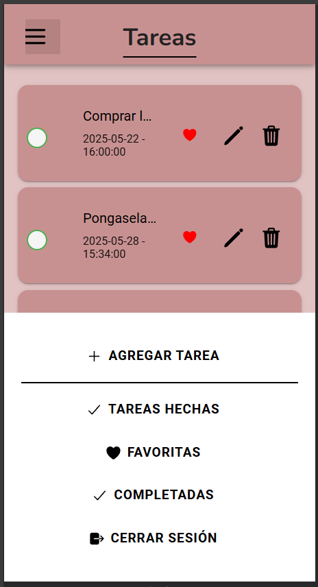
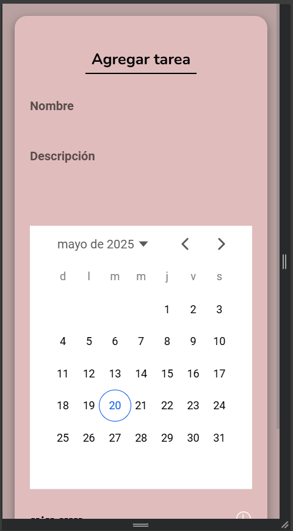

## HU-04: Agregar una Nueva Tarea

### Descripción
Como usuario, quiero poder agregar una nueva tarea con un título y una descripción, para organizar mis pendientes y no olvidarlos.

---

### Criterios de Aceptación
- ✅ Se debe poder escribir una tarea en un campo de texto.  
- ✅ Debe existir un botón para agregar la tarea a la lista.  
- ✅ La tarea agregada debe mostrarse en la lista inmediatamente.  
- ✅ No se debe permitir agregar tareas vacías.  
- ✅ Opción para seleccionar fechas para hacer tareas.  
- ✅ Botón para cancelar la acción.  

---

### Definición de Listo
- El diseño de la interfaz está claro.  
- Se ha definido la estructura de la lista de tareas.  

---

### Definición de Hecho
- La funcionalidad está programada y funcionando correctamente.  
- Se ha probado en al menos un dispositivo físico o emulador.  
- No hay errores críticos que impidan el uso.  

### Capturas de Funcionamiento
**Captura Agregar**

**Captura Agregacion de Tarea**

