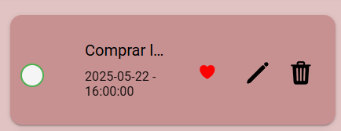
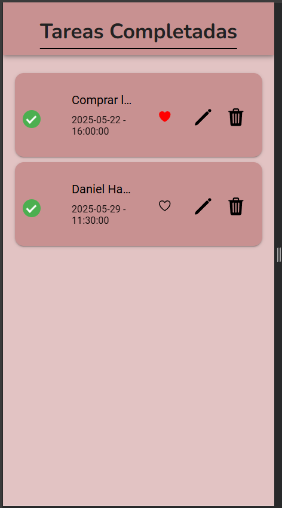

## HU-05: Marcar Tareas como Completadas

### Descripción
Como usuario, quiero marcar una tarea como completada, para saber qué tareas ya he terminado y cuáles siguen pendientes.

---

### Criterios de Aceptación
- ✅ Cada tarea debe tener un checkbox o botón para marcarla como completada.  
- ✅ La tarea completada debe cambiar de estilo.  
- ✅ Las tareas completadas deben mantenerse en la lista hasta que sean eliminadas.  

---

### Definición de Listo
- Se ha definido cómo se mostrará una tarea completada.  

---

### Definición de Hecho
- La funcionalidad está implementada y probada.  
- No hay errores críticos.  

### Capturas de Funcionamiento
**Captura Vista Check**

**Captura Vista Completadas**

