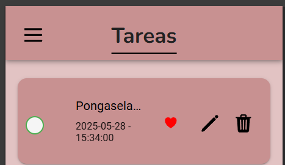

## HU-06: Eliminar una Tarea

### Descripción
Como usuario, quiero eliminar una tarea de la lista, para deshacerme de tareas innecesarias o creadas por error.

---

### Criterios de Aceptación
- ✅ Cada tarea debe tener un botón para eliminarla.  
- ✅ Al presionar el botón, la tarea debe desaparecer de la lista.  
- ✅ Se debe mostrar una alerta de confirmación antes de eliminar.  

---

### Definición de Listo
- Se ha definido cómo se eliminarán las tareas.  

---

### Definición de Hecho
- La funcionalidad está programada y probada.  

### Capturas de Funcionamiento
**Captura Vista Check Eliminar**

**Captura Vista Confirmacion**

