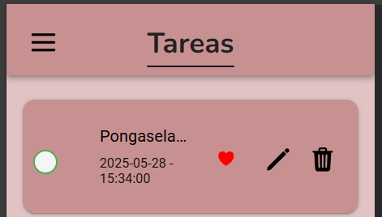
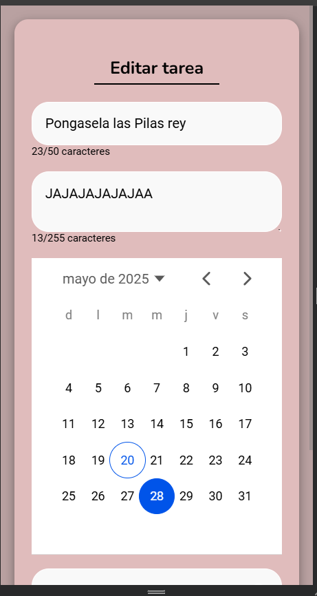

## HU-08: Editar una Tarea

### Descripción
Como usuario, quiero poder modificar una tarea ya creada, para corregir errores o actualizar la información si es necesario.

---

### Criterios de Aceptación
- ✅ Debe haber un botón de edición en cada tarea.  
- ✅ Al editar, la tarea debe actualizarse en la lista.  

---

### Definición de Listo
- Se ha definido cómo funcionará la edición.  

---

### Definición de Hecho
- La funcionalidad está probada.  

### Capturas de Funcionamiento
**Captura Vista Check Editar**

**Captura Vista Formulario Edicion**

