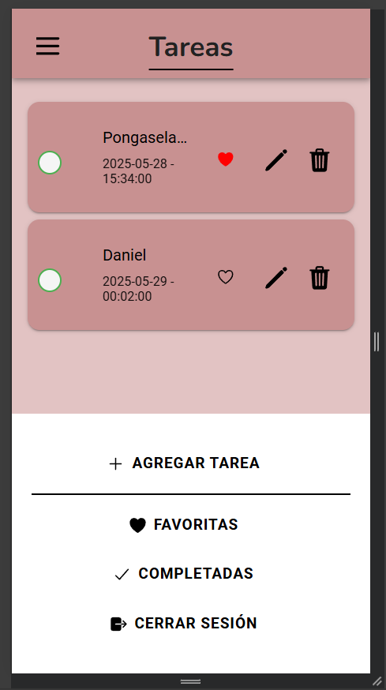

## HU-09: Ver el Estado de Mis Tareas

### Descripción
Como usuario, quiero ver mis tareas en una lista organizada, para identificar fácilmente cuáles están pendientes y cuáles ya completé.

---

### Criterios de Aceptación
- ✅ La pantalla principal debe mostrar todas las tareas.  
- ✅ Se debe diferenciar entre tareas completadas y pendientes.  

---

### Definición de Listo
- Se ha definido el diseño visual de la lista.  

---

### Definición de Hecho
- La funcionalidad está probada en distintos dispositivos.  

### Capturas de Funcionamiento
**Captura Vista Opciones de Estados**

